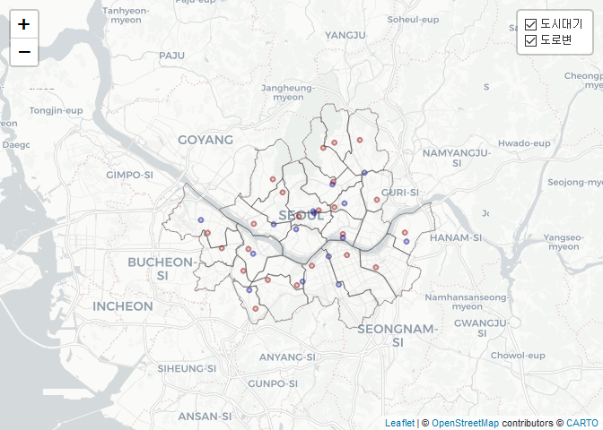
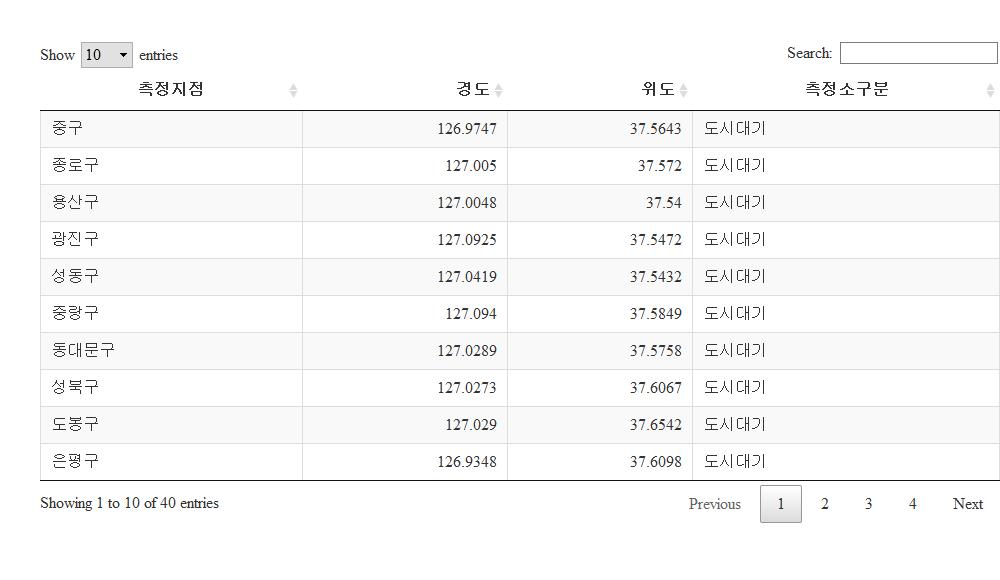

서울의 대기질 Part1: 측정소
================

## 대기오염 측정망 현황

서울시는 대기오염예경보제 운영, 대기오염실태 파악 및 대기질 개선대책 수립에 필요한 기초자료를 확보하기 위하여 대기오염측정망을
설치 운영하고 있다. 서울시는 도시대기측정망을 구별로 1개소씩 25개소, 도로변의 자동차에 의한 오염물질의 발생과 변화
등을 관리하기 위하여 자동차의 통행이 많은 간선도로(10개소)과 2011년부터 중앙차로 및 자동차 전용차로에도 측정소를
추가 설치하여 총 15개소의 도로변 대기오염측정소를 운영하고 있다. 이외에도 도시경계측정망(3개소)과 장거리 이동오염물질
측정을 위한 배경측정망(3개소), 도시 상공의 대기질 측정을 위한 입체측정망(3개소) 등 총 50개 측정소(도시대기 25,
도로변 15, 배경경계입체 10)을 운영하고 있다.

<!-- --> 대기오염측정소는
서울시대기질을 24시간 자동 측정하여 서울시 보건환경연구원으로 전송한 후 서울특별시 대기환경정보
(<http://cleanair.seoul.go.kr>)를 통해 시민에게 실시간으로 공개하도록 하고 있다. 측정값은 자료
확정과정을 거쳐 서울시 및 환경부로 보내 관리하고 있으며, 이떄통계자료의 신뢰성 제고를 위하여 통계처리 대상기간
중 75% 이상의 측정치가 확보된 경우에만 유효한 통계자료로 활용하고 있다.

<!-- -->

PM2.5 are particles or droplets of size 2.5 microns or less are a major
part of polluted air and is associated with various negative health
effects. There is no safe limit for PM2.5 and WHO guideline value is 10
ug/m3 for annual average. Long term exposure to these particles cause
increased rate of heart disease, stroke, lung diseases, kidney disease,
and diabetes.
